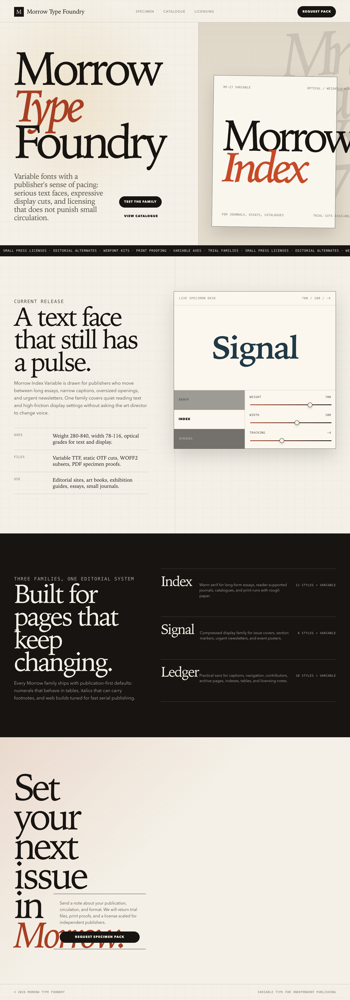
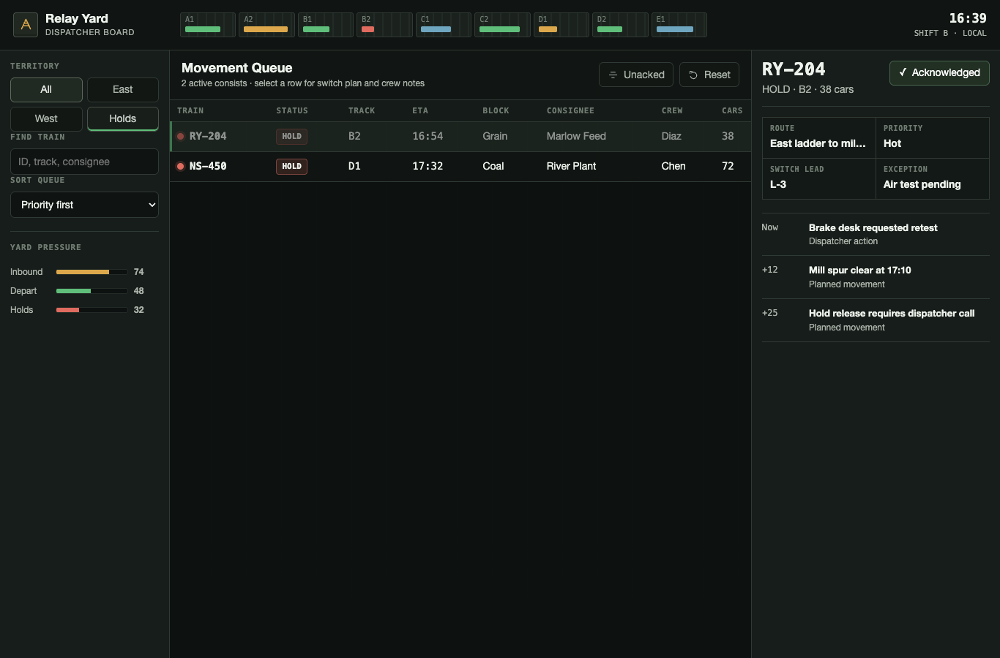
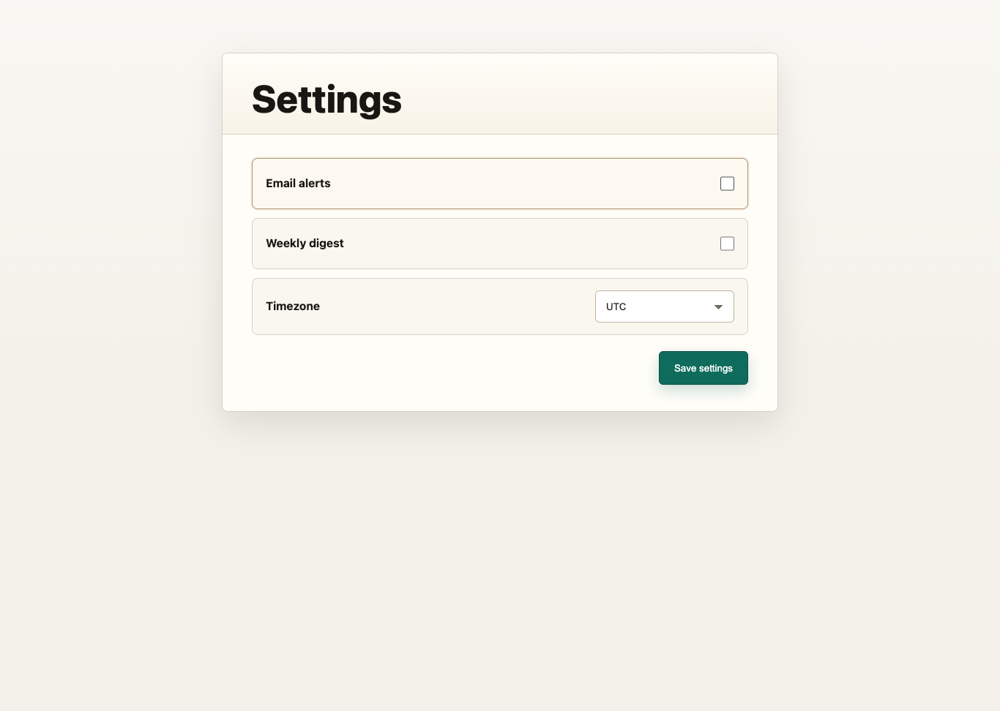

# Frontend Design Codex Skill

Codex local skill for distinctive, production-grade frontend design implementation.

This skill helps Codex build and redesign frontend surfaces with a clear visual direction, reusable design tokens, responsive behavior, useful interactions, and browser-verifiable output. It is a Codex-native rewrite adapted from Anthropic's public `frontend-design` Claude Code plugin workflow.

## What It Covers

- Frontend design pre-analysis before coding
- Visual direction selection across multiple style families
- Anti-generic AI UI rules
- Typography, color, spacing, component, motion, and asset guidance
- Existing design system reuse
- Responsive desktop/mobile rules
- Browser or Playwright verification
- Evidence-based final handoff format

## Install

Clone this repository directly into your Codex skills directory:

```bash
mkdir -p ~/.codex/skills
git clone https://github.com/KilimiaoSix/frontend-design-codex-skill.git ~/.codex/skills/frontend-design-codex
```

Then start a new Codex session or refresh skill discovery. The skill name is:

```text
frontend-design-codex
```

## Usage

Explicit trigger:

```text
Use $frontend-design-codex to build a non-generic landing page for a boutique robotics studio. Pick a distinctive visual direction, implement the page, and verify it in a browser.
```

Natural trigger:

```text
Redesign this dashboard so it feels production-grade, dense, readable, responsive, and less like a generic AI-generated UI.
```

## Validate Locally

If you have Codex's local skill validator available:

```bash
python3 ~/.codex/skills/.system/skill-creator/scripts/quick_validate.py ~/.codex/skills/frontend-design-codex
```

Expected result:

```text
Skill is valid!
```

## Examples

The `examples/` folder contains browser-verified static outputs generated while testing this skill:

- `examples/landing/index.html`
- `examples/dashboard/index.html`
- `examples/settings-redesign/settings.html`

Preview screenshots:







## Notes

- This repository is not affiliated with Anthropic or OpenAI.
- The migrated skill is a Codex-native rewrite, not a Claude marketplace plugin package.
- Source inspiration and attribution details are listed in `NOTICE` and `docs/MIGRATION.md`.

## License

Apache-2.0. See `LICENSE`.
